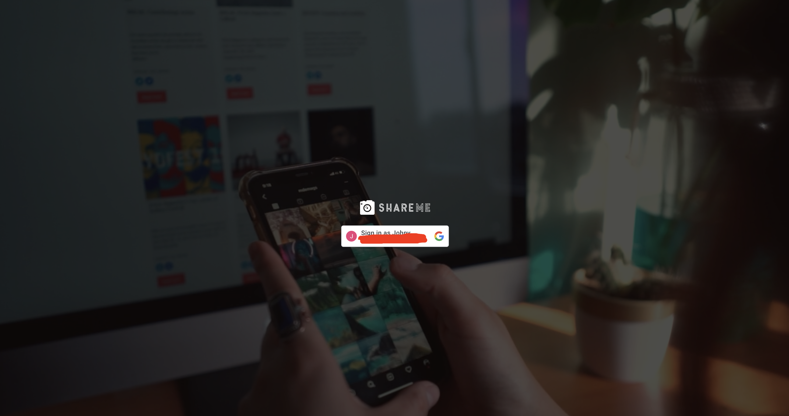
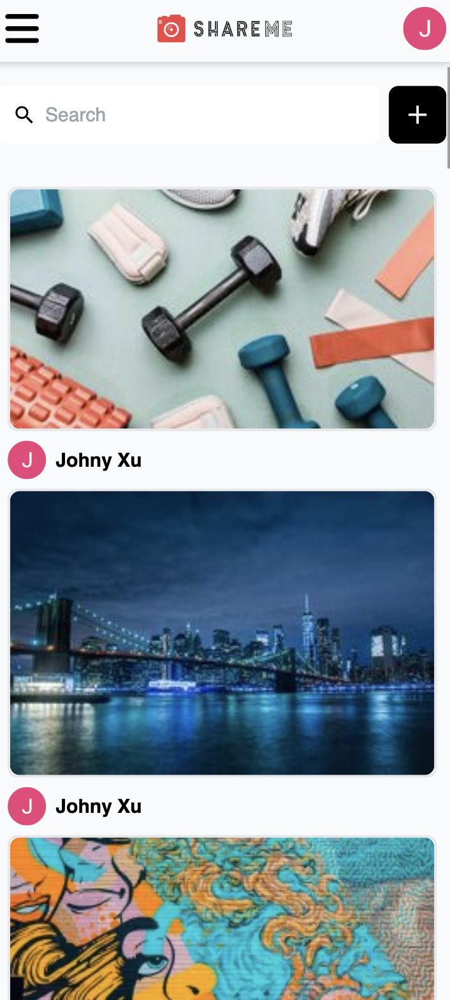
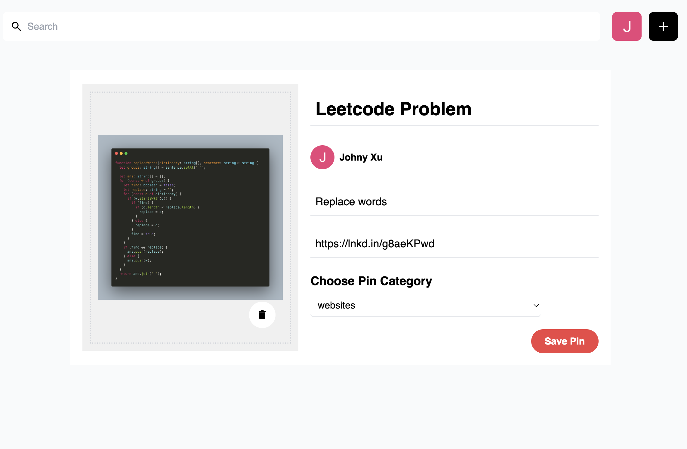
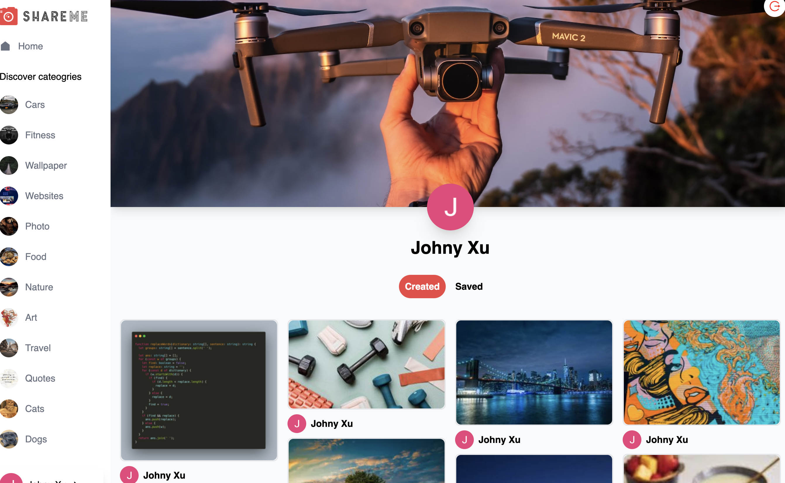

# Social Media

## Introduction
This is a social share website, you can upload an image to the background and login with google account.
You could see many categories on the left sidebar of the website after you login. and share one image with Title, Description, Link and the category of the image. After upload it success, you can see the image that you uploaded just now in the category. it provide you download, delete, save function to the image and also you can make some comments to this image.


## Get started
1. Create Google API Key
  Step: Left Navbar -> New Project -> Create a new project -> API & Services -> Credentials -> Create Credentials -> OAuth

2. Configure Oatuh consent screen:
  External -> App name, user Support email, Email Address -> Save and continue -> OAuth consent screen -> Publish

3. Create OAuth Client
  Web application -> URI(http://localhost:3000)
  Generate the ClientId, ClientSecret.

4. Create and get:
  How to delete a project:
  Select a project -> Settings (Right) -> Select one -> delete

5. Sanity Manage
  Go to the backend of your sanity account management page.
  Get Project ID and token API Tab -> Add API Token -> socail media token

5. add origin to sanity
  CORS origins:
  ```http://localhost:3333```
  ```http://localhost:3000/```


## Deploy

`npm run build`
drop build folder to netlify platform

## Screenshots

- Login



- Home


- Home(Mobile)



- Upload Image



- Profile
